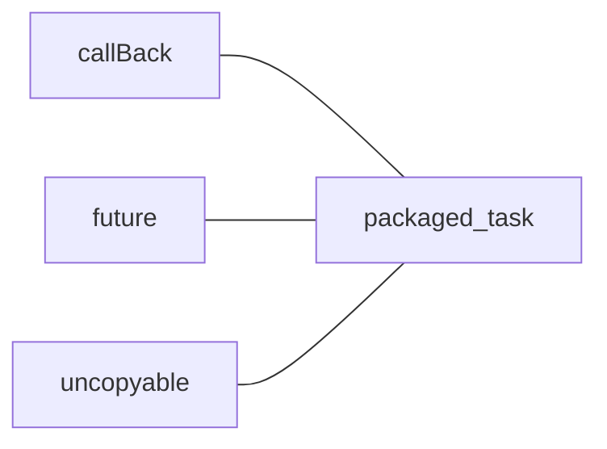

# packaged_task

1. 可以作为一个可调用对象作为线程入口。
2. 不可拷贝，只能移动
3. 必须要要先`get_future`再启动线程
4. 在`future` 的`get`函数阻塞， 需要动作执行完成之后才返回结果

---

# promise

1. 与` packaged_task`类似，但是它不是一个可调用对象，函数入口需要通过传参
2.  通过 `set_value` 返回结果，一旦前者设置，立刻返回结果，比前者更灵活

